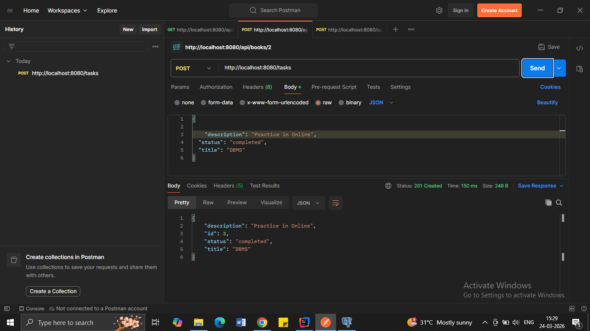
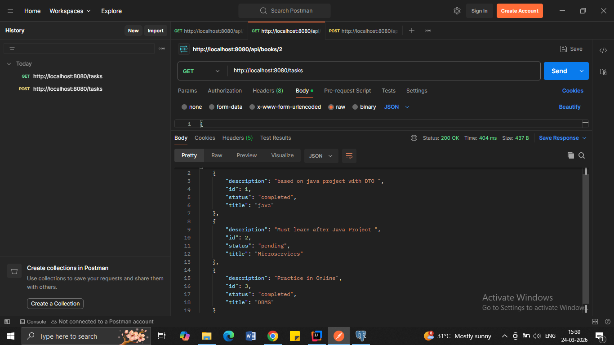
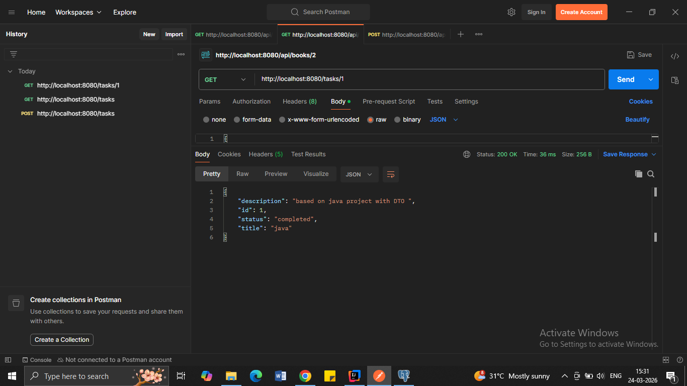
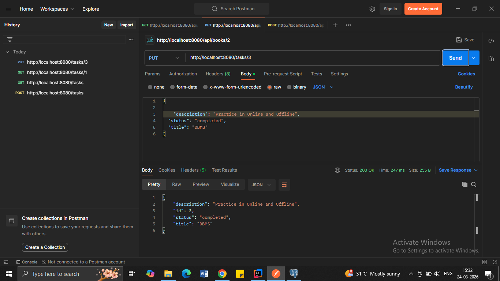
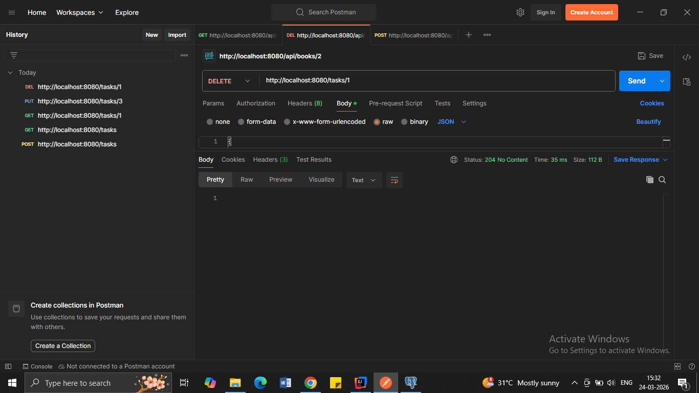

# Task Management System

## 📌 Overview
This is a backend REST API project built using Java and Spring Boot to manage tasks. It supports creating, updating, deleting and view tasks.

---

## 🚀 Tech Stack
- Java
- Spring Boot
- Spring Data JPA (Hibernate)
- PostgreSQL
- Maven

---

## ⚙️ Features
- Create, update and delete tasks
- DTO pattern implementation
- Layered architecture (Controller-Service-Repository)

---

## 🔗 API Endpoints

| Method | Endpoint            | Description        |
|--------|---------------------|--------------------|
| POST   | /tasks              | Create new task    |
| GET    | /tasks              | Get all tasks      |
| GET    | /tasks/{id}         | Get task by ID     |
| PUT    | /tasks/{id}         | Update task        |
| DELETE | /tasks/{id}         | Delete task        |

---

## 🧪 Testing
APIs tested using Postman.

---

## 📸 Screenshots

### Create Task (POST)

### Get All Tasks (GET)

### Get Task by ID (GET)

### Update Task (PUT)

### Delete Task (DELETE)

---

## ▶️ How to Run
1. Clone the repo
2. Open in IntelliJ
3. Configure PostgreSQL in `application.properties`
4. Run the application
